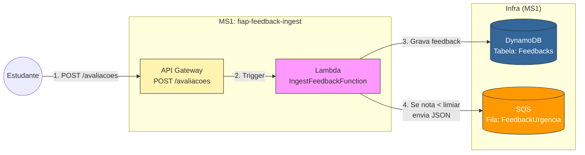

# FIAP Feedback Ingestão (Microsserviço 1)

Este repositório contém o microsserviço de **Ingestão** da plataforma de Feedback. Ele é responsável por receber as avaliações dos alunos, armazená-las no banco de dados e encaminhar feedbacks críticos (nota baixa) para uma fila de urgência.

### Arquitetura da Solução



## 🚀 Como Utilizar a API

Para interagir com o sistema, é necessário autenticar-se via AWS Cognito e utilizar o token gerado para enviar feedbacks.

### 1. Configuração do Usuário (Pré-requisito)

Antes de enviar requisições, você deve criar um usuário no AWS Cognito e obter o `ClientId`.

#### A. Obter o ClientId

1. Acesse o **Console da AWS** e vá para o serviço **CloudFormation**.

2. Selecione a stack `feedback-ms1-ingestion`.

3. Vá na aba **Outputs** e copie o valor de `CognitoClientId`.

#### B. Criar e Ativar Usuário

1. Acesse o serviço Amazon Cognito > User Pools.

2. Clique no User Pool criado (ex: FeedbackStudentsPool).

3. Vá em Users > Create user.
    - Username: aluno_teste (ou outro de sua preferência).
    - Password: Defina uma senha temporária.

4. **Ativação (Confirmação da Senha):**

    - Para evitar o fluxo de troca de senha no primeiro login, você pode definir a senha como permanente via AWS CLI:

    ```
    aws cognito-idp admin-set-user-password \
      --user-pool-id <SEU_USER_POOL_ID> \
      --username aluno_teste \
      --password <SUA_SENHA_DEFINITIVA> \
      --permanent
    ```
    *(O `user-pool-id` também pode ser encontrado na aba Outputs do CloudFormation ou no topo da página do User Pool)*

### 2. Autenticação (AWS Cognito)

O serviço utiliza o Cognito User Pool `us-east-1`.

**Endpoint:** `POST https://cognito-idp.us-east-1.amazonaws.com`  
**Content-Type:** `application/x-amz-json-1.1`

#### A. Fazer Login (Obter Token)

Utilize este passo para obter o `IdToken` ou `AccessToken`.

*   **Header:** `X-Amz-Target: AWSCognitoIdentityProviderService.InitiateAuth`
*   **Body:**

```json
{
  "AuthFlow": "USER_PASSWORD_AUTH",
  "ClientId": "{CLIENT_ID}",
  "AuthParameters": {
    "USERNAME": "student-username",
    "PASSWORD": "senha123"
  }
}
```

#### B. Redefinir Senha (Primeiro Acesso)

Se o login retornar um desafio `NEW_PASSWORD_REQUIRED`, utilize este passo para definir a nova senha.

*   **Header:** `X-Amz-Target: AWSCognitoIdentityProviderService.RespondToAuthChallenge`
*   **Body:**

```json
{
  "ClientId": "{CLIENT_ID}",
  "ChallengeName": "NEW_PASSWORD_REQUIRED",
  "Session": "<INSIRA_A_SESSION_RETORNADA_NO_PASSO_ANTERIOR>",
  "ChallengeResponses": {
    "USERNAME": "student-username",
    "NEW_PASSWORD": "NovaSenha@123"
  }
}
```

---

### 3. Criar Feedback

Após obter o token de autenticação (Bearer Token), envie o feedback para o API Gateway.

**Endpoint:** `POST {AWS_API_GATEWAY}/avaliacao`  
*(Substitua `{AWS_API_GATEWAY}` pela URL gerada no deploy, ex: `https://xyz.execute-api.us-east-1.amazonaws.com`)*

*   **Authorization:** `Bearer <SEU_TOKEN_AQUI>`
*   **Body:**

```json
{
    "descricao": "Descricao do Feedback",
    "nota": 3
}
```

---

## 📦 Como Fazer o Deploy

> [!WARNING]
> Para rodar localmente é necessário:
> - Java 17
> - Maven
> - AWS SAM CLI

1. **Build da aplicação (gera o artefato da Lambda):**
```bash
sam build
```

2.  **Execute o deploy guiado com base no `samconfig.toml` já existente:**
```bash
sam deploy
```

3. **Para deletar os recursos criados na AWS**
```bash
sam delete --stack-name fiap-feedback-ingest
```

---
**Desenvolvido para o Tech Challenge da FIAP - Fase de Cloud Computing & Serverless.**

